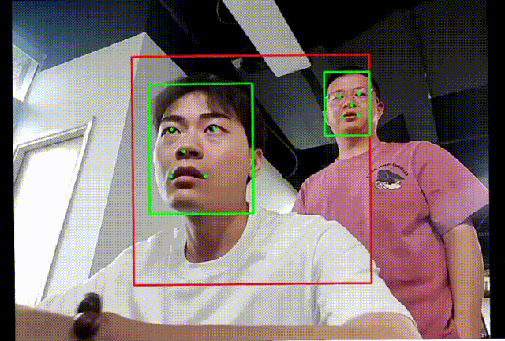

<h3>deeplearn-java</h3>	

<table border="1">
  <tr>
    <th></th>
  </tr>
</table>

<table class="table">
<thead>
<tr>
<th>
Number
</th>
<th>
Project
</th>
<th>
Description
</th>
</tr>
</thead>
<tbody>
<tr><td>1</td><td>android_ncnn_hand</td><td>ncnn hand detection + hand keypoint detection</td></tr>
<tr><td>2</td><td>android_ncnn_nanodet</td><td>nanodet, real-time inference for ncnn object detection</td></tr>
<tr><td>3</td><td>android_ncnn_yolovx</td><td>yolov5, real-time inference for ncnn object detection</td></tr>
<tr><td>4</td><td>android_onnx_image_classification</td><td>onnx video inference test, image classification, this is the official ort example</td></tr>
<tr><td>5</td><td>android_onnx_maskrcnn</td><td>onnx model, using ort for inference, mask rcnn instance segmentation</td></tr>
<tr><td>6</td><td>android_onnx_movenet</td><td>Google movenet keypoint detection, onnx model, ort inference, single image</td></tr>
<tr><td>7</td><td>android_onnx_movenet_camera</td><td>Google movenet keypoint detection, onnx model, ort inference, video inference</td></tr>
<tr><td>8</td><td>android_onnx_sam</td><td>onnx model, using ort for inference, deploying meta-ai segmentation model sam</td></tr>
<tr><td>9</td><td>android_onnx_sparselnst</td><td>onnx model, using ort for inference, open local single image for sparselnst instance segmentation</td></tr>
<tr><td>10</td><td>android_onnx_stable_diffusion</td><td>diffusion model, sd painting, onnx model, ort deployment</td></tr>
<tr><td>11</td><td>android_onnx_yolov5</td><td>onnx model, using ort for inference, yolov5 open local single image for inference</td></tr>
<tr><td>12</td><td>android_onnx_yolov5_camera</td><td>yolov5 video snapshot inference, button to switch between preview and snapshot modes, ort inference, onnx model</td></tr>
<tr><td>13</td><td>android_onnx_yolov5_car_plate</td><td>yolov5 license plate keypoint detection, onnx model using ort inference, video snapshot inference</td></tr>
<tr><td>14</td><td>android_onnx_yolov7_head</td><td>yolov7 head detection, onnx model, ort inference, local single image</td></tr>
<tr><td>15</td><td>android_opencv_onnx_hand_3d_landmark</td><td>onnx model, using ort for inference, using opencv for preprocessing and postprocessing, hand keypoint detection, gesture prediction</td></tr>
<tr><td>16</td><td>android_opencv_onnx_modnet_matting</td><td>onnx model, using ort for inference, using opencv for preprocessing and postprocessing, modnet portrait real-time matting</td></tr>
<tr><td>17</td><td>android_opencv_onnx_movenet_keypoint</td><td>onnx model, using ort for inference, using opencv for preprocessing and postprocessing, movenet, real-time human keypoint detection by Google</td></tr>
<tr><td>18</td><td>android_opencv_onnx_rtmdet</td><td>onnx model, using ort for inference, using opencv for preprocessing and postprocessing, scrfd face keypoint detection, restrict recognition area</td></tr>
<tr><td>19</td><td>android_opencv_onnx_scrfd_face_landmark</td><td>onnx model, using ort for inference, using opencv for preprocessing and postprocessing, scrfd face keypoint detection, restrict recognition area</td></tr>
<tr><td>20</td><td>android_opencv_onnx_yolov5</td><td>onnx model, using ort for inference, using opencv for preprocessing and postprocessing, yolov5n_256x256 object detection</td></tr>
<tr><td>21</td><td>android_opencv_onnx_yolov5_car_plate</td><td>onnx model, using ort for inference, using opencv for preprocessing and postprocessing, real-time license plate detection and recognition</td></tr>
<tr><td>22</td><td>android_opencv_onnx_yolov5_car_plate2</td><td>onnx model, using ort for inference, using opencv for preprocessing and postprocessing, real-time license plate detection and recognition, restrict recognition area, accelerate inference by expanding surrounding area through interpolation</td></tr>
<tr><td>23</td><td>android_opencv_onnx_yolov5_face_landmark</td><td>onnx model, using ort for inference, using opencv for preprocessing and postprocessing, yolov5 face keypoint detection, restrict recognition area</td></tr>
<tr><td>24</td><td>android_opencv_onnx_yolov5_head</td><td>onnx model, using ort for inference, using opencv for preprocessing and postprocessing, yolov5 head detection</td></tr>
<tr><td>25</td><td>android_opencv_onnx_yolov8_mozu_det</td><td>onnx model, using ort for inference, using opencv for preprocessing and postprocessing, yolov8 module object detection</td></tr>
<tr><td>26</td><td>android_opencv_onnx_yolov8_pose_ruler</td><td>onnx model, using ort for inference, using opencv for preprocessing and postprocessing, real-time yolov8 triangular ruler detection</td></tr>
<tr><td>27</td><td>android_opencv_onnx_yolovp2_drive</td><td>onnx model, using ort for inference, using opencv for preprocessing and postprocessing, yolovp2 lane line, drivable area, object detection</td></tr>
<tr><td>28</td><td>android_sherpa_onnx_ars_demo</td><td>onnx model, using the sherpa-onnx framework, ARS (Chinese + English)</td></tr>
<tr><td>29</td><td>android_sherpa_onnx_tts_demo</td><td>onnx model, using the sherpa-onnx framework, TTS (Chinese + English)</td></tr>
<tr><td>30</td><td>img</td><td></td></tr>
</tbody>
</table>

