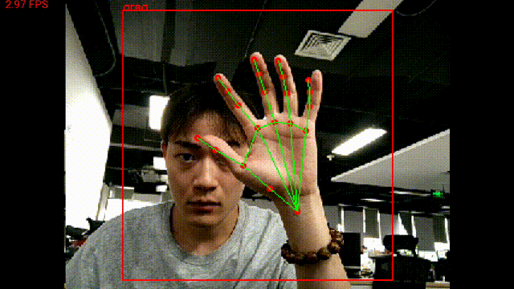

<h3>deeplearn-mobile</h3>	

<table border="1">
  <tr>
<th></th>
  </tr>

</table>
  

<table class="table">
<thead>
<tr>
<th>
编号
</th>
<th>
项目
</th>
<th>
说明
</th>
</tr>
</thead>
<tbody>
<tr><td>1</td><td>android_ncnn_hand</td><td>ncnn手掌检测+手掌关键点检测</td></tr>
<tr><td>2</td><td>android_ncnn_nanodet</td><td>nanodet,ncnn目标检测实时推理</td></tr>
<tr><td>3</td><td>android_ncnn_yolovx</td><td>yolov5,ncnn目标检测实时推理</td></tr>
<tr><td>4</td><td>android_onnx_image_lassification</td><td>onnx 视频推理测试,图片分类,这个是ort官方例程</td></tr>
<tr><td>5</td><td>android_onnx_maskrcnn</td><td>onnx模型,使用ort推理,mask rcnn 实例分割</td></tr>
<tr><td>6</td><td>android_onnx_movenet</td><td>谷歌movenet关键点检测,onnx模型,ort推理,单个图片</td></tr>
<tr><td>7</td><td>android_onnx_movenet_camera</td><td>谷歌movenet关键点检测,onnx模型,ort推理,视频推理</td></tr>
<tr><td>8</td><td>android_onnx_sam</td><td>onnx模型,使用ort推理,部署 meta-ai 分割一切模型 sam</td></tr>
<tr><td>9</td><td>android_onnx_sparselnst</td><td>onnx模型,使用ort推理,打开本地单个图片进行推理 sparselnst 实例分割</td></tr>
<tr><td>10</td><td>android_onnx_stable_diffusion</td><td>扩散模型,sd绘画,onnx模型,ort部署</td></tr>
<tr><td>11</td><td>android_onnx_yolov5</td><td>onnx模型,使用ort推理,yolov5打开本地单个图片进行推理</td></tr>
<tr><td>12</td><td>android_onnx_yolov5_camera</td><td>yolov5视频抓拍推理,按钮切换预览和抓拍模式,ort推理,onnx模型</td></tr>
<tr><td>13</td><td>android_onnx_yolov5_car_plate</td><td>yolov5车牌关键点检测,onnx模型使用ort推理,视频抓拍推理</td></tr>
<tr><td>14</td><td>android_onnx_yolov7_head</td><td>yolov7人头检测,onnx模型,ort推理,本地单个图片</td></tr>
<tr><td>15</td><td>android_opencv_onnx_hand_3d_landmark</td><td>onnx模型,使用ort推理,使用opencv预处理和后处理,hand 关键点检测,手势预测</td></tr>
<tr><td>16</td><td>android_opencv_onnx_modnet_matting</td><td>onnx模型,使用ort推理,使用opencv预处理和后处理,modnet 人像实时matting</td></tr>
<tr><td>17</td><td>android_opencv_onnx_movenet_keypoint</td><td>onnx模型,使用ort推理,使用opencv预处理和后处理,movenet,实时人体谷歌点检测</td></tr>
<tr><td>18</td><td>android_opencv_onnx_rtmdet</td><td>onnx模型,使用ort推理,使用opencv预处理和后处理,scrfd人脸关键点检测,限制识别区域</td></tr>
<tr><td>19</td><td>android_opencv_onnx_scrfd_face_landmark</td><td>onnx模型,使用ort推理,使用opencv预处理和后处理,scrfd人脸关键点检测,限制识别区域</td></tr>
<tr><td>20</td><td>android_opencv_onnx_yolov5</td><td>onnx模型,使用ort推理,使用opencv预处理和后处理,yolov5n_256x256 目标检测</td></tr>
<tr><td>21</td><td>android_opencv_onnx_yolov5_car_plate</td><td>onnx模型,使用ort推理,使用opencv预处理和后处理,实时车牌检测和识别</td></tr>
<tr><td>22</td><td>android_opencv_onnx_yolov5_car_plate2</td><td>onnx模型,使用ort推理,使用opencv预处理和后处理,实时车牌检测和识别,限制识别区域,通过插值扩充周围区域加速推理</td></tr>
<tr><td>23</td><td>android_opencv_onnx_yolov5_face_landmark</td><td>onnx模型,使用ort推理,使用opencv预处理和后处理,yolov5人脸关键点检测,限制识别区域</td></tr>
<tr><td>24</td><td>android_opencv_onnx_yolov5_head</td><td>onnx模型,使用ort推理,使用opencv预处理和后处理,yolov5人头检查</td></tr>
<tr><td>25</td><td>android_opencv_onnx_yolov8_mozu_det</td><td>onnx模型,使用ort推理,使用opencv预处理和后处理,yolov8 模组目标检测</td></tr>
<tr><td>26</td><td>android_opencv_onnx_yolov8_pose_ruler</td><td>onnx模型,使用ort推理,使用opencv预处理和后处理,实时yolov8三角尺检测</td></tr>
<tr><td>27</td><td>android_opencv_onnx_yolovp2_drive</td><td>onnx模型,使用ort推理,使用opencv预处理和后处理,yolovp2 车道线、可行驶区域、目标检测</td></tr>
<tr><td>28</td><td>img</td><td></td></tr>
</tbody>
</table>

